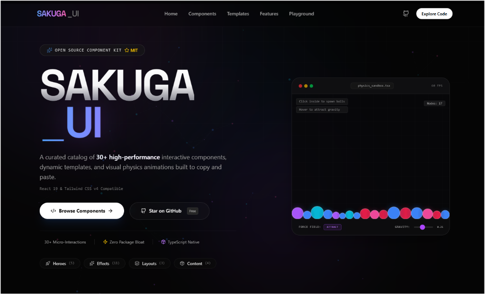

# ⚡ Sakuga UI

A premium collection of high-performance, interactive React components designed to make modern web applications look and feel state-of-the-art.

*"Sakuga" (作画) refers to breathtaking sequences in anime where the animation quality shoots through the roof. This library brings that exact visual punch and fluid motion to your user interface.*



<div align="center">

[🚀 Live Demo](https://5173-ig4c0e0wnlo2gv4xzd34s-a402f90a.sandbox.novita.ai) • [📦 Browse Components](#-component-catalog) • [🛠️ Setup](#-quick-start) • [🤝 Contribute](CONTRIBUTING.md)

</div>

---

## 🚀 Quick Start

Get the local gallery running in under a minute:

```bash
# Clone the repository
git clone https://github.com/prateekraiger/sakuga-ui.git
cd sakuga-ui

# Install dependencies
pnpm install

# Start local server
pnpm dev
```
Open `http://localhost:5173` to explore the gallery.

---

## ⚡ How to Use

Sakuga UI is **copy-paste friendly**—no bulky npm packages required.

1. **Find**: Run the showcase locally or visit the [Live Demo](https://5173-ig4c0e0wnlo2gv4xzd34s-a402f90a.sandbox.novita.ai).
2. **Copy**: Click the **Code** button on any component in the gallery.
3. **Paste**: Paste the source code directly into your React project (e.g., `src/components/ui/MyComponent.tsx`).

```tsx
import MyComponent from '@/components/ui/MyComponent';

export default function Page() {
  return <MyComponent />;
}
```

---

## 📦 Component Catalog

* **🌌 Hero Sections**: Nebula Hero (Cosmic particles), Flux Hero (3D glassmorphic), Quantum Hero (Physics canvas sandbox), Helios, Growth, House of Tania.
* **🍱 Layouts & Bento Grids**: Bento Grid, Analytics Bento (with real-time charts), Glass Header.
* **🎭 Visual Effects**: Liquid Distortion WebGL ripples, Voxel Terrain 3D voxels, Pixel Wave grid, Focus Lens, Fracture Glass, Velocity Text, Marquee scroll.

---

## 🛠️ Tech Stack

* **React 19** & **TypeScript 5**
* **Tailwind CSS v4** (CSS-first config)
* **Vite 6** (lightning-fast development server)
* **Three.js** (GPU-accelerated WebGL 3D effects)

---

## 🤝 Contributing & License

We welcome contributions! Please see [CONTRIBUTING.md](CONTRIBUTING.md) for conventions. Licensed under the **MIT License**—see [LICENSE](LICENSE) for details.

---
